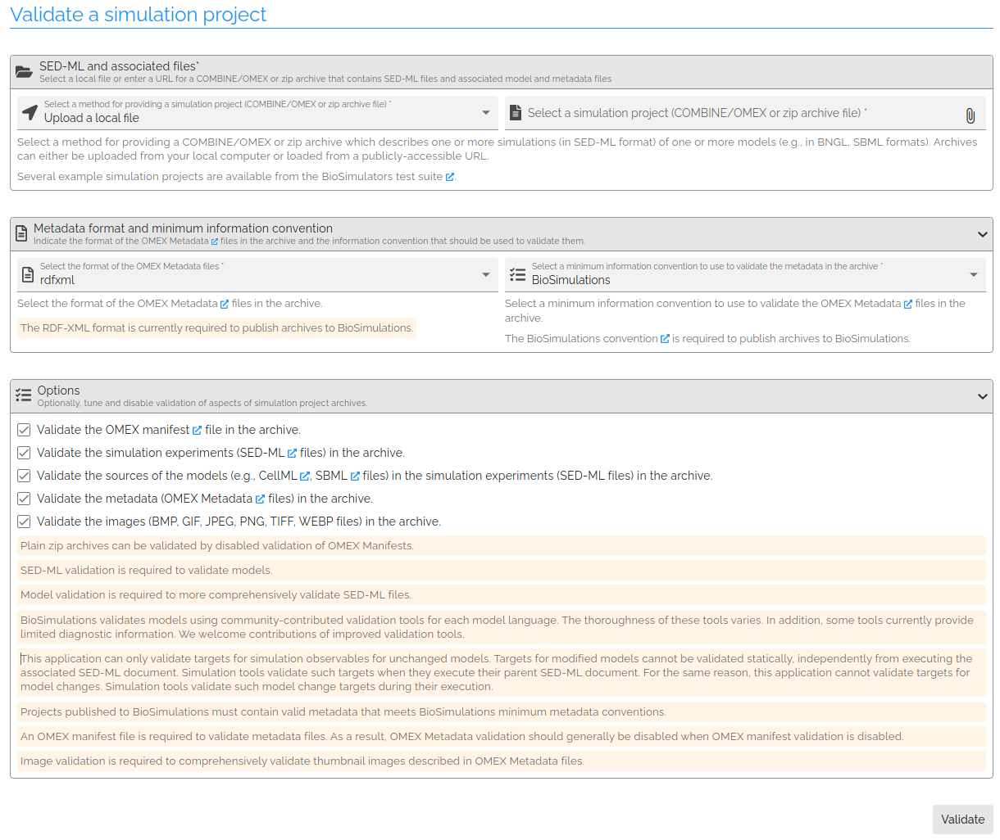

# Validating simulation projects (COMBINE/OMEX archives)

BioSimulations provides a tool for validating the contents of a COMBINE/OMEX archive. This tool is available on [runBioSimulations](https://run.biosimulations.org/utils/validate-project). The user can upload a COMBINE/OMEX archive or provide a URL to a COMBINE/OMEX archive. Optionally, the user can select a subset of the archive to validate (e.g., only SED-ML files). The tool will validate the contents of the archive and report any errors. The interface provides a report of the validation results, including validation of the model file, SED-ML file, metadata, archive manifest, and any images presented in the archive.

!!!warning
    This application can only validate targets for simulation observables for unchanged models. Targets for modified models cannot be validated statically, independently from executing the associated SED-ML document. Simulation tools validate such targets when they execute their parent SED-ML document. For the same reason, this application cannot validate targets for model changes. Simulation tools validate such model change targets during their execution.

This validation can also be accessed programmatically from the [BioSimulations API](https://combine.api.biosimulations.org).

--8<-- "glossary.md"