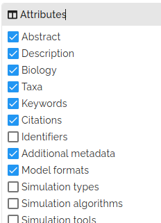
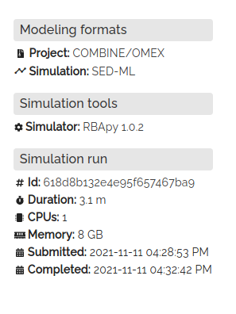

# User guide: finding, exploring & reusing projects

## Finding projects

Published projects can be browsed at [https://biosimulations.org/projects](https://biosimulations.org/projects). Each card presents a project, with a thumbnail and title. Mousing over the thumbnail shows additional details about the project. You can customize the attributes you want to view. 

### Selecting attributes

{align=right}
Clicking on the search icon in the top-right corner of the page opens menu with an attributes sub-menu. From here, you can select the attributes you want to view. Selecting a field will add the attributes to the details presented in the project card when you mouse over the thumbnail.

 <!-- The new lines must be followed by two spaces-->
&NewLine;  
&NewLine;  
&NewLine;  
&NewLine;  
&NewLine;  
&NewLine;  

### Searching for projects
{align=right}
Clicking on the the search icon at the top right of the page opens a search box. A search term, such as 'metabolism' can be entered in the search box. By default, the search term is searched against each [attribute](#selecting-attributes) of the project. Optionally, you can restrict the search to a specific attribute. For example, if you want to search for projects that have the value 'Escherichia coli' in the `taxa`  attribute, you can enter 'taxa:Escherichia coli' in the search box. For attributes with spaces in the name, replace any spaces with "-". For example, the term "last-updated:2020" searches for projects that contain the value "2020" in the `last updated` attribute. A list of the available fields is available in the [FAQs](faqs.md).

### Filtering projects

{align=right}
The list of displayed project can be filtered by the values of their attributes. For each available attribute a menu of values is presented. Selecting a value will filter the list of projects to include only those with that value.

 <!-- The new lines must be followed by two spaces-->
&NewLine;  
&NewLine;  
&NewLine;  
&NewLine;  
&NewLine;  
&NewLine;  

## Exploring projects

Clicking on a project card opens a page with the project details. The "Overview" tab provides the associated project [metadata](#Metadata), as well as information about underlying model and [simulation run](#simulation-runs). The "Select chart" tab allows you to configure [visualizations](#visualizations) of the simulation results that can then be viewed on the "View chart" tab. The "Files" tab provides downloads for the project [files](#files).

### Metadata

BioSimulations collects metadata to enable searching, browsing and discovering projects. The metadata includes information about authorship, license, funding and other provenance information. It also includes information about the modelled system, such as the modelled organism, and tags to describe the project.

### Visualizations

Projects can be visualized using both predefined and custom visualizations. The "Select chart" tab allows you to select from visualizations that are defined and included in the project. Additionally, you can create your own custom visualization, by selecting one of the "Design a chart" options. These include histograms, heatmaps and lineplots. Selecting a plot time will open an additional menu with configuration options to select the datasets to be plotted.
Once you have configured your visualization, you can view it by clicking on the "View chart" button.  The "Export to Vega" button will export the visualization to a [Vega](https://vega.github.io/) specification. For more information on using Vega with BioSimulations, see [here](../concepts/visualizations.md).

### Simulation Runs
{ align=left }
More detailed information about the simulation execution and results can be viewed by following the links to the runBioSimulations page for the simulation. The "Logs" tab provides detailed output of the simulation execution, including each individual simulation step and the outputs (reports and plots) produced by the simulation. Each step of the simulation is presented as a collapsible section that can be expanded to show the outputs. Both structured log files and raw output files can be downloaded from the links. 

## Reusing projects

### Creating and executing variants of simulations with runBioSimulations

In addition to this full-featured web application, [runBioSimulations](https://run.biosimulations.org) provides a simpler web application and REST API for executing simulations. runBioSimulations simply enables users to execute COMBINE archives using a variety of simulation tools and generate time series plots of their results. This application does not require an account.

### Downloading projects and executing them with your own computers

#### Downloading projects

The models, simulations, and visualizations in BioSimulations can be programmatically obtained using our [REST API](https://api.biosimulations.org). Documentation for the API is available at the same URL.

#### Recommended tools for further exploring simulation projects
BioSimulations provides basic capabilities for reproducing and reusing a wide range of biomodeling projects. For further work, we encourage users to use the domain-specific online platforms, desktop programs, and libraries outlined below. Consistent interfaces to the desktop and library tools below are available from [BioSimulators](https://biosimulators.org), including Docker images, command-line interfaces and Python APIs. More information about obtaining and using these tools is available from [BioSimulators](https://biosimulators.org). 

!!! warning

    While the BioSimulators interfaces to these tools support SED-ML and the COMBINE/OMEX archive format, the primary versions of most of the tools below do not support these formats or do not support them consistently with the specifications of the SED-ML format.

    
| Framework          | Language | Online programs                                | Desktop programs                         | Libraries  |
|--------------------|----------|------------------------------------------------|------------------------------------------|------------|
| Continuous kinetic | BNGL     |                                                | [BioNetGen](https://bionetgen.org/)      | [pyBioNetGen](https://pybionetgen.readthedocs.io/)    |
| Continuous kinetic | CellML   |                                                | [OpenCOR](https://opencor.ws/)           | [OpenCOR](https://opencor.ws/)    |
| Continuous kinetic | NeuroML  |                                                | [NetPyNe](http://www.netpyne.org/), [NEURON](https://neuron.yale.edu/neuron/), [pyNeuroML](https://github.com/NeuroML/pyNeuroML)  | [NetPyNe](http://www.netpyne.org/), [NEURON](https://neuron.yale.edu/neuron/), [pyNeuroML](https://github.com/NeuroML/pyNeuroML)    |
| Continuous kinetic | SBML     | [JWS Online](http://jjj.biochem.sun.ac.za/)    | [BioNetGen](https://bionetgen.org/), [COPASI](http://copasi.org/), [tellurium](http://tellurium.analogmachine.org/), [VCell](https://vcell.org/) | [AMICI](https://amici.readthedocs.io/), [GillesPy2](https://stochss.github.io/GillesPy2/), [libRoadRunner](https://libroadrunner.org/), [LibSBMLSim](http://fun.bio.keio.ac.jp/software/libsbmlsim/), [pyBioNetGen](https://pybionetgen.readthedocs.io/), [PySCeS](http://pysces.sourceforge.net/)   |
| Continuous kinetic | XPP ODE  |                                                | [XPP](http://www.math.pitt.edu/~bard/xpp/xpp.html)        |         |
| Discrete kinetic   | BNGL     |                                                | [BioNetGen](https://bionetgen.org/)      | [pyBioNetGen](https://pybionetgen.readthedocs.io/)    |
| Discrete kinetic   | SBML     | [StochSS](https://stochss.org/)                | [BioNetGen](https://bionetgen.org/), [COPASI](http://copasi.org/), [tellurium](http://tellurium.analogmachine.org/), [VCell](https://vcell.org/) | [GillesPy2](https://stochss.github.io/GillesPy2/), [libRoadRunner](https://libroadrunner.org/), [pyBioNetGen](https://pybionetgen.readthedocs.io/)   |
| Flux balance       | SBML     | [Fluxer](https://fluxer.umbc.edu/)             | [CBMPy](http://cbmpy.sourceforge.net/)             | [CBMPy](http://cbmpy.sourceforge.net/), [COBRApy](https://opencobra.github.io/cobrapy/)        |
| Logical            | GINsim   |                                                | [GINsim](http://ginsim.org/)           |    |
| Logical            | SBML     | [Cell Collective](https://cellcollective.org/) | [GINsim](http://ginsim.org/)           | [BoolNet](https://sysbio.uni-ulm.de/?Software:BoolNet#:~:text=BoolNet%20is%20an%20R%20package,available%20from%20BoolNet's%20CRAN%20page.)   |
| MASS               | SBML     |                                                |                                                    | [MASSpy](https://masspy.readthedocs.io/)        |
| Resource balance   | RBA XML  |                                                |                                                    | [RBApy](https://sysbioinra.github.io/RBApy/)        |
| Spatial discrete   | Smoldyn  |                                                | [Smoldyn](https://www.smoldyn.org/)                | [Smoldyn](https://www.smoldyn.org/)        |

    

    

    

    

    

